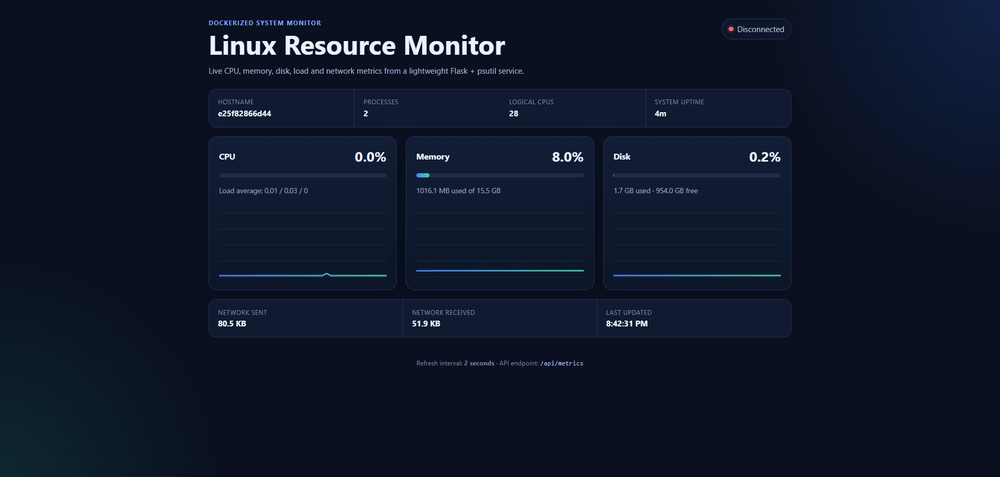

# Linux Resource Monitor Dashboard

## Dashboard Preview



A lightweight **Dockerized Linux resource-monitoring dashboard** built with **Python, Flask, psutil, HTML/CSS, and JavaScript**. The application exposes a JSON metrics API and a responsive browser dashboard for observing CPU, memory, disk, load average, process count, uptime, and cumulative network I/O.

## Highlights

- Live CPU, memory, and disk utilization with 2-second refreshes.
- Lightweight history charts implemented in vanilla JavaScript with the HTML Canvas API.
- Additional Linux/system information: load average, uptime, process count, CPU count, and network I/O.
- REST-style JSON endpoint at `/api/metrics`.
- Container health endpoint at `/health`.
- Production-style Gunicorn server inside Docker.
- Runs as a **non-root user** inside the container.
- Docker health check and Docker Compose configuration.
- Automated `pytest` test suite.
- GitHub Actions workflow that runs tests and validates the Docker build on pushes and pull requests.
- No external frontend framework or charting dependency.

## Architecture

```text
Browser Dashboard
       |
       | GET /api/metrics every 2 seconds
       v
Flask Application
       |
       v
     psutil
       |
       v
Linux / Container Resource Metrics
```

## Metrics

The dashboard currently reports:

| Category | Metrics |
|---|---|
| CPU | utilization %, logical/physical CPU counts |
| Memory | used, available, total, utilization % |
| Disk | used, free, total, utilization % |
| Load | 1-, 5-, and 15-minute load averages |
| System | hostname, process count, system uptime |
| Network | cumulative bytes sent and received |

## Project Structure

```text
Linux-Resource-Monitor-Dashboard/
├── .github/
│   └── workflows/
│       └── ci.yml
├── static/
│   ├── dashboard.js
│   └── style.css
├── templates/
│   └── index.html
├── tests/
│   └── test_app.py
├── .dockerignore
├── .gitignore
├── app.py
├── docker-compose.yml
├── Dockerfile
├── requirements.txt
├── requirements-dev.txt
└── README.md
```

## Run Locally

### Requirements

- Python 3.10+

### Setup

```bash
python -m venv .venv
```

Windows PowerShell:

```powershell
.\.venv\Scripts\Activate.ps1
pip install -r requirements-dev.txt
python app.py
```

Linux/macOS:

```bash
source .venv/bin/activate
pip install -r requirements-dev.txt
python app.py
```

Open:

```text
http://localhost:5000
```

## Run with Docker

Build the image:

```bash
docker build -t linux-resource-monitor .
```

Run the container:

```bash
docker run --rm -p 5000:5000 --name linux-resource-monitor linux-resource-monitor
```

Then open:

```text
http://localhost:5000
```

Or use Docker Compose:

```bash
docker compose up --build
```

Stop it with:

```bash
docker compose down
```

## API

### `GET /api/metrics`

Example response:

```json
{
  "cpu": {"usage_percent": 13.4},
  "memory": {
    "usage_percent": 42.1,
    "used_human": "5.2 GB",
    "total_human": "12.4 GB"
  },
  "disk": {
    "usage_percent": 37.8,
    "used_human": "42.3 GB",
    "free_human": "69.6 GB"
  },
  "host": {
    "hostname": "monitor-host",
    "process_count": 87
  }
}
```

### `GET /health`

```json
{"status": "ok"}
```

## Tests

Install development dependencies and run:

```bash
pytest -q
```

The test suite verifies helper formatting, the health endpoint, the metrics endpoint schema, and valid resource percentages.

## Docker Monitoring Scope

When the application runs **directly on Linux**, `psutil` reads metrics from that Linux environment.

When it runs **inside Docker**, the values visible to `psutil` depend on the host kernel, container namespace, and Docker runtime. Therefore, the dashboard should be described as a Linux/container resource monitor rather than a guaranteed full-host monitoring agent. For production host monitoring, additional host-level mounts, privileges, or a purpose-built metrics collector would be required.

## Portfolio Value

This project demonstrates practical experience with:

- Linux system metrics
- Python backend development
- REST APIs
- Browser-side asynchronous updates
- Docker image creation and containerization
- Docker Compose
- Automated testing
- GitHub Actions CI
- Basic production deployment practices

## Author

**Anas Hamdan Al-Haj**  
Computer Science, Birzeit University
